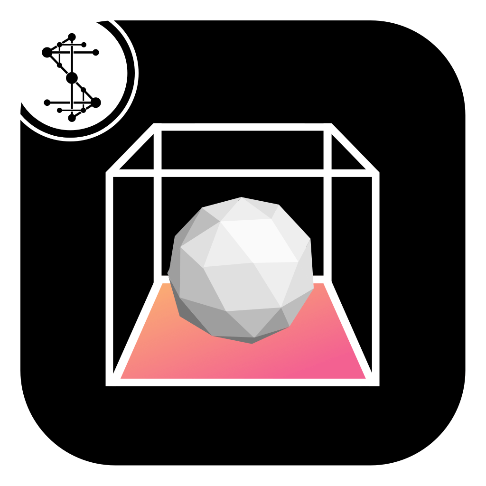
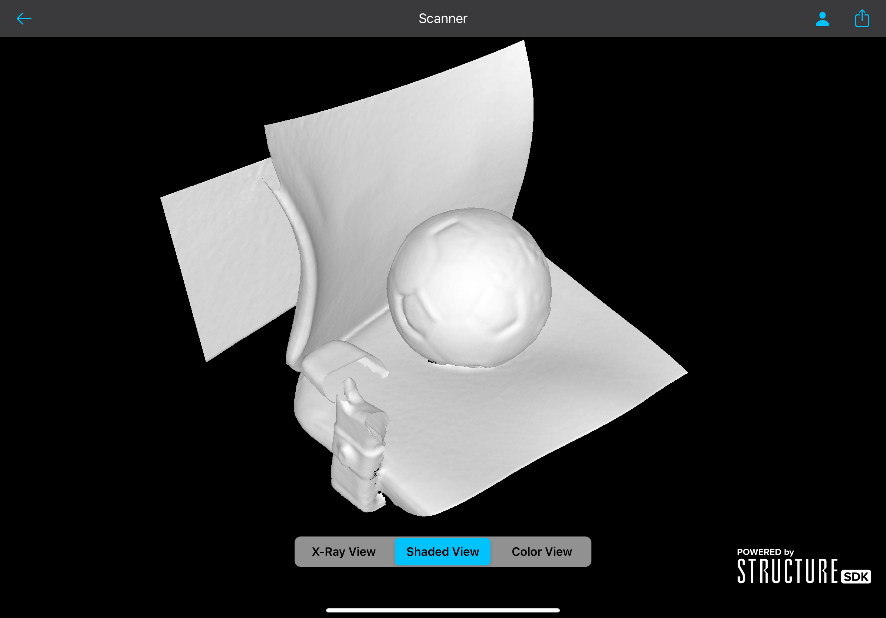
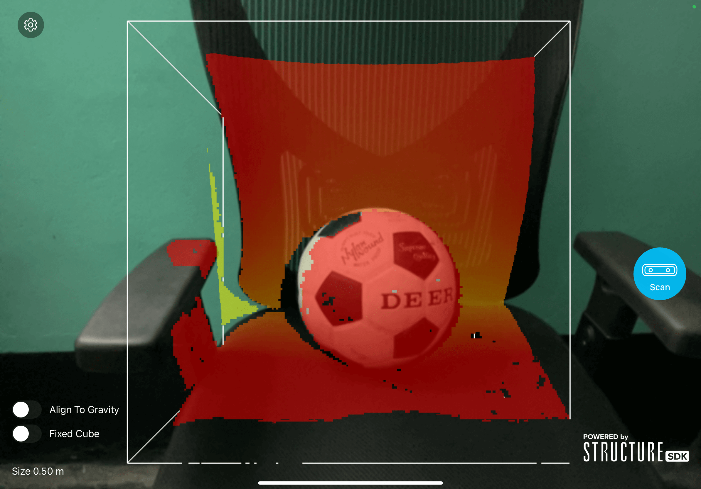

<h1 align="center"> Scanner </h1> <br>
<p align="center">
  <a href="https://apps.apple.com/us/app/scanner-structure-sdk/id891169722">
    
  </a>
</p>

<p align="center">
  Scanner sample app. Open Source and built using Swift.
</p>

<p align="center">
  <a href="https://itunes.apple.com/us/app/gitpoint/id1251245162?mt=8">
    
  </a>
</p>

<!-- START doctoc generated TOC please keep comment here to allow auto update -->
<!-- DON'T EDIT THIS SECTION, INSTEAD RE-RUN doctoc TO UPDATE -->
## Table of Contents

- [Introduction](#introduction)
- [Features](#features)
- [Feedback](#feedback)
- [Contributors](#contributors)
- [Build Process](#build-process)
- [Acknowledgments](#acknowledgments)
- [License](#license)

<!-- END doctoc generated TOC please keep comment here to allow auto update -->

## Introduction

This simple and easy to use application allows you to capture 3D models of objects and people by simply walking around them with your iPad and the Structure Sensor accessory.

<p align="center">
  
</p>

## Features

A few of the things you can do with Scanner:

* **Real-time Scanning:** Allow users to view the 3D model as they scan it, giving instant feedback on the scanning progress.
* **3D Model Export:** Offer options to export 3D models in various file formats such as .obj, .stl, .ply, for compatibility with 3D modeling software and 3D printers.
* **Feedback and Support:** Include a feature for users to provide feedback and access customer support.

<p align="center">
  
</p>

## Feedback

Feel free to send us feedback on [Structure Support](https://support.structure.io/) or [file an issue](). Feature requests are always welcome. 

## Contributors

If you wish to contribute, please take a quick look at the [code-of-conduct](./CODE_OF_CONDUCT.md)! This project follows the [all-contributors]() specification.

## Build Process
This app is made for the Structure Sensor accessory. If you do not have a Structure Sensor accessory, please visit [structure.io](http://structure.io) to learn more.

- Get the StructureSDK from [Developer Portal](https://structure.io/developers).
- Clone or download the repo
- Put `Structure.xcframework` file to Framework directory.
- Add your sdk license key in `ViewController.swift`:
```
let status = STLicenseManager.unlock(withKey: "")
```
- Build using XCode.

Please take a look at the [contributing guidelines]() for a detailed process on how to build your application as well as troubleshooting information.

## Acknowledgments
The original author of this project is [Christopher Worley](cworley@ruthlessresearch.com).

## License
[](https://opensource.org/licenses/BSD-3-Clause)

Distributed under the BSD-3-Clause License. See `LICENSE.txt` for more information.